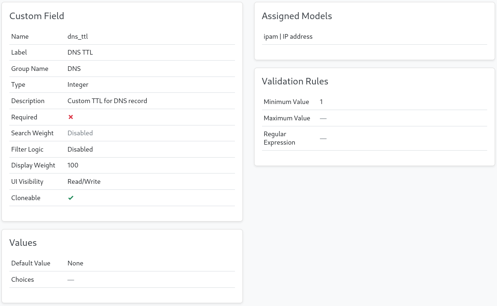

# NetBox PowerDNS sync plugin

A [Netbox](https://github.com/netbox-community/netbox) plugin to manage
DNS records in PowerDNS based on netbox IP Address and Device objects.

## Features

- Automatically generates A & AAAA records based on IP Address & Device objects
  and DNS zone settings
- Can manage multiple DNS Zones across multiple PowerDNS servers
- Flexible rules to match netbox IP Addresses into DNS zones
- Multiple options how to generate DNS name from IP address or Device
- Option to schedule sync of DNS zones from netbox to PowerDNS
- Can add DNS records for new zones immediately

## Generating DNS names

Each zone can define tags on IPAddress, Interface/VMInterface, FGRPGroup
or Device/VirtualMachine that match that zone. You can also match on
device role. A zone can also be only used for IPs that are assigned to management
only interfaces. 

When determining the zone to use for an IP Address, match rules are evaluated
as follows:

- check if IPAddress.dns_name matches any zone
- check if IPAddress is assigned to Device or VirtualMachine and if its name
  matches any zone
- check if IPAddress is assigned to FHRPGroup and if its name matches any zone

If no match is found then it will try to match based on assigned tags in this
order: IPAddress.tags, Interface.tags, VMInterface.tags, Device.tags,
VirtualMachine.tags, Device.device_role, VM.role.

If there is still not matching zone found, default zone is used (if set).

When a zone is set for an IP address, the DNS name is generated by using
set methods set on the zone. THe IP naming method is tried first, then the
device and lastly the FHRP group method.

## Compatibility

This plugin requires netbox version 3.5.x to work. Here is s compatibility table:

| NetBox Version | Plugin Version |
|----------------|----------------|
|       3.5      |      1.0.x     |

## Installing

Review [official Netbox plugin documentation](https://docs.netbox.dev/en/stable/plugins/#installing-plugins) for installation instructions.

You install the plugin from pypi with pip. Make sure you activate Netbox's virtual
environment first:

```bash
$ source /opt/netbox/venv/bin/activate
(venv) $ pip install netbox-powerdns-sync
```

For adding to a NetBox Docker setup see
[the general instructions for using netbox-docker with plugins](https://github.com/netbox-community/netbox-docker/wiki/Using-Netbox-Plugins).

You can install a development version directly from GitHub:

```bash
pip install git+https://github.com/ArnesSI/netbox-powerdns-sync.git@master
```

or by adding to your `local_requirements.txt` or `plugin_requirements.txt` (netbox-docker):

```bash
git+https://github.com/ArnesSI/netbox-powerdns-sync.git@master
```

After installation, enable the plugin in `/opt/netbox/netbox/netbox/configuration.py`,
 or if you use netbox-docker, your `/configuration/plugins.py` file :

```python
PLUGINS = [
    'netbox_powerdns_sync'
]

PLUGINS_CONFIG = {
    "netbox_powerdns_sync": {},
}
```

Available configuration settings you can use in `PLUGINS_CONFIG` are described
below under [settings](#settings).

The last step is to apply database migrations and update netbox search index:

```bash
(venv) $ cd /opt/netbox/netbox/
(venv) $ python3 manage.py migrate
(venv) $ python3 manage.py reindex --lazy
```

If you're running under netbox-docker, you can skip this as migrations and index updates are applied if needed automatically when you bring up the containers.

## Settings

If you want to override the defaults for the plugin, you can do so in your via `/opt/netbox/netbox/netbox/configuration.py`,
 or if you use netbox-docker, your `/configuration/plugins.py` file :

```python
PLUGINS = [
    'netbox_powerdns_sync'
]

PLUGINS_CONFIG = {
    "netbox_powerdns_sync": {
        # Example settings below, see "Available settings"
        # in README.md for all possible settings
        "ttl_custom_field": "",
        "powerdns_managed_record_comment": None,
    },
}
```

### Available settings

| Setting | Default value | Description |
|---------|---------------|-------------|
| `ttl_custom_field` | `None`| Name of netbox Custom field applied to IP Address objects. See [Custom TTL field](#CustomTTLfield) below. |
| `powerdns_managed_record_comment` | `"netbox-powerdns-sync"`| Is set, the plugin will only touch records in PowerDNS API that have matching comment and ignore others. Set to `None` to make plugin manage all supported records. |

#### Custom TTL field

Normaly TTL for records is set by Default TTL on each Zone. There is an option to
set TTL for each DNS record individually. You need to define a netbox
[Custom field](https://docs.netbox.dev/en/stable/customization/custom-fields/)
of type integer and apply it to IP Address objects. Then set plugin option
`ttl_custom_field` to the name of that field.



Now you can set TTL on each IP Address and any corresponding DNS records will get
that TTL value.
